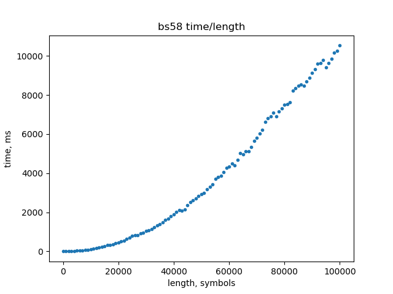

# Possible DoS of Insight

### Insight

What it is it? [Insight](https://insight.is/) is bitcoin blockchain explorer and API provider. Currently Insight replaced by [Bitcore Node](https://github.com/bitpay/bitcore/blob/master/packages/bitcore-node), but I'll talk about [Insight API v0.4.3](https://github.com/bitpay/insight-api/tree/v0.4.3). This was last release before [BitPay](https://bitpay.com/) started rewrite it, and changes not clear, there was few betas, you can found v5 beta in GitHub tags, later they produced `Bitcore Node` instead Insight. But `v0.4.3` is widely used by bitcoin forks.

### Idea

One time when I go through source code of [insight-api](https://github.com/bitpay/insight-api/tree/v0.4.3) I realized that service can be hanged up if anybody will send very big not valid address in POST request to `/insight-api/addrs/utxo`. Why? Well, I knew that [Base 58](https://en.bitcoin.it/wiki/Base58Check_encoding) encoding is slow for big strings/buffers in JavaScript. I created small tool ([bs58-time-chart](./bs58-time-chart/bs58-time.js)) which show time dependency from length, take a look:



For 100KB payload we need \~10 seconds. It's means that if we will send such payload to service and service will try decode it without length validation, everything rest will be delayed for all decoding time. Why? Because JavaScript is single threaded.

UTXO method: https://github.com/bitpay/insight-api/blob/v0.4.3/lib/index.js#L204

`checkAddrs` middleware: https://github.com/bitpay/insight-api/blob/v0.4.3/lib/addresses.js#L92-L100

Address validation: https://github.com/bitpay/insight-api/blob/v0.4.3/lib/addresses.js#L112-L119

Base58 decode in Address constructor: https://github.com/bitpay/bitcore-lib/blob/v0.16.0/lib/address.js#L288

### PoC

Demonstration tool placed in [./insight-api-dos](./insight-api-dos):

```bash
node insight-dos.js
```

It's not clear, why exactly this not work [https://insight.bitpay.com/](https://insight.bitpay.com/), maybe there not `v0.4.3` anymore? But it's still work on some Insight's, example output for [https://ravencoin.network](https://ravencoin.network):

```bash
2019-08-04T08:32:30.160Z Start DoS call id#1
2019-08-04T08:32:30.526Z Best hash: 00000000000029ba2ac2f3a493ec69d8e66ba027dfd6f653a36a369525882cc8 (382.94ms)
2019-08-04T08:32:36.296Z Best hash: Timeout (3149.32ms)
2019-08-04T08:32:39.536Z Best hash: Timeout (3140.85ms)
2019-08-04T08:32:42.778Z Best hash: Timeout (3141.18ms)
2019-08-04T08:32:46.036Z Best hash: Timeout (3155.93ms)
2019-08-04T08:32:47.669Z DoS call id#1 error: Bad Request
2019-08-04T08:32:47.669Z DoS call id#1 done in 17507.44ms
2019-08-04T08:32:47.971Z Best hash: 00000000000029ba2ac2f3a493ec69d8e66ba027dfd6f653a36a369525882cc8 (1835.51ms)
2019-08-04T08:32:48.279Z Best hash: 00000000000029ba2ac2f3a493ec69d8e66ba027dfd6f653a36a369525882cc8 (307.77ms)
```

i.e. 1 call stopped all other requests for \~17s.

If you want generate own Base58 input: `node gen-post-body.js`

## Bitcore Node

[Current Bitcore Node](https://github.com/bitpay/bitcore/blob/v8.2.0/packages/bitcore-node/docs/api-documentation.md) code not implement POST methods which expect Base58 encoded data, so it's possible to say that this was fixed in some way :)

But `Bitcore Node` introduced intersting thing like `Publick Key` API. Unfortunately strict validation ignored again.

First issue related with adding addresses not related with Public Key. In such way we can add arbitrary addresses and then call `balance` method which is aggregation. As demonstration I created small script ([./bitcore-node-pubkey/index.js](./bitcore-node-pubkey/index.js)) which add top 10k addresses by UTXO to specified wallet and later ask about balance. Address import process little wired, so probably after waiting few minutes you will need kill process, comment `walletImportAddresses` function call and run it again. In the end [Cloudflare](https://www.cloudflare.com/) will return HTTP code `520`. While it's not looks like thing which kill service, but this should make database much slower.

Second issue related with allowing huge strings as arguments (100MB hardoded (!) [source](https://github.com/bitpay/bitcore/blob/v8.2.0/packages/bitcore-node/src/routes/index.ts#L10-L20)). I was able create wallet record with wallet name which have 10MiB size. With default rate limit it's possible sent such request every second, which give ~843GiB (10 * 60 * 60 * 24 / 1024) database size increase in 24 hours. What if data will be sent from 100 addresses, how soon service will down?

After reporting about this to BitPay they fixed part of it: [bitpay/bitcore/pull/2310](https://github.com/bitpay/bitcore/pull/2310), [bitpay/bitcore/pull/2313](https://github.com/bitpay/bitcore/pull/2313), [bitpay/bitcore/pull/2314](https://github.com/bitpay/bitcore/pull/2314).
